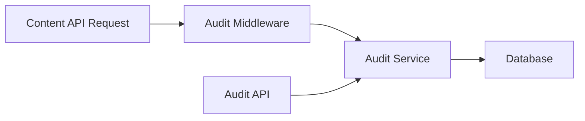

# Content API Audit

This project implements an audit logging system for a Content API. It automatically creates audit log entries whenever a record is created, updated, or deleted. Each log entry captures essential information about the action performed.

## Features

- Logs actions: create, update, delete
- Captures details: content type, record ID, timestamp, user, and changed fields
- REST API endpoint `/audit-logs` for retrieving logs
- Supports filtering by content type, user ID, action type, and date range
- Pagination and sorting capabilities

## Architecture Overview

### System Components
- **Middleware**: Intercepts Content API requests
- **Audit Service**: Handles log creation and retrieval
- **Database**: Stores audit logs in dedicated collection
- **API**: Provides filtered access to audit logs



## Project Structure

```
content-api-audit
├── src
│   ├── models
│   │   ├── auditLog.ts
│   │   └── index.ts
│   ├── middleware
│   │   └── auditLogger.ts
│   ├── routes
│   │   └── auditLogs.ts
│   ├── services
│   │   └── auditLogService.ts
│   ├── types
│   │   ├── auditLog.ts
│   │   └── index.ts
│   ├── utils
│   │   └── pagination.ts
│   └── app.ts
├── tests
│   └── auditLogger.test.ts
├── package.json
├── tsconfig.json
└── README.md
```

## Installation

1. Clone the repository.
2. Navigate to the project directory.
3. Run `npm install` to install dependencies.

## Usage

To start the application, run:

```
npm start
```

The server will be running, and you can access the audit logs via the `/audit-logs` endpoint.

## Contributing

Contributions are welcome! Please open an issue or submit a pull request for any enhancements or bug fixes.

## License

This project is licensed under the MIT License.